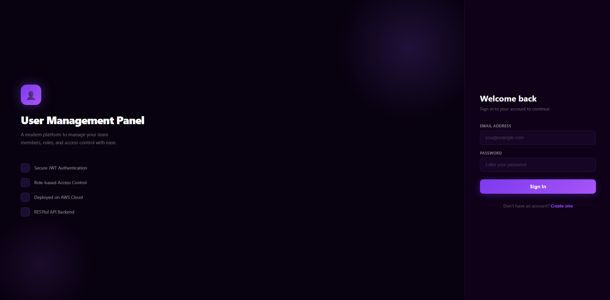
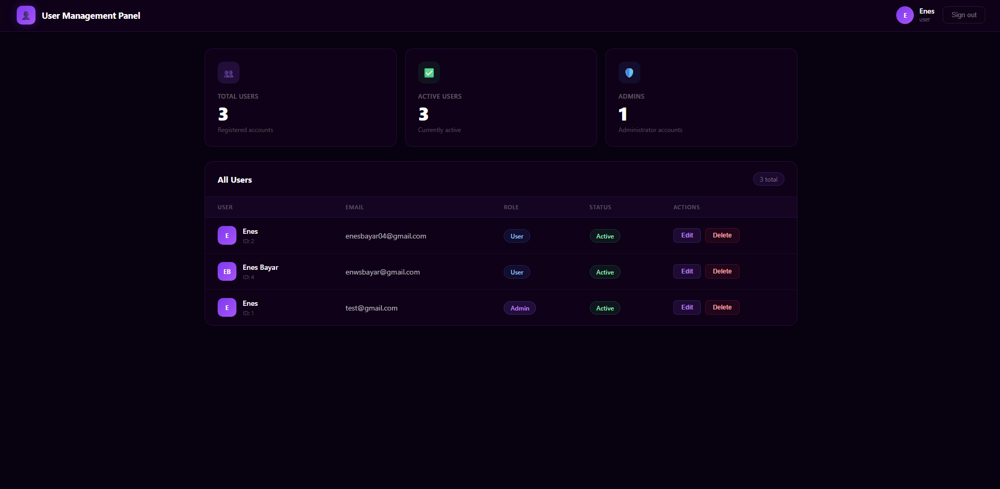

# 👤 User Management Panel

A full-stack web application built with **Node.js (Express.js)** on the backend and **React** on the frontend, deployed on **AWS**.

## 🏗️ Architecture

```
┌─────────────────┐        ┌──────────────────┐        ┌──────────────┐
│   React (S3 +   │  HTTP  │  Express.js API   │  SQL   │  PostgreSQL  │
│   CloudFront)   │ ──────▶│  (EC2 Instance)   │ ──────▶│  (AWS RDS)   │
└─────────────────┘        └──────────────────┘        └──────────────┘
```

## 🚀 Tech Stack

| Layer    | Technology                    |
| -------- | ----------------------------- |
| Frontend | React 18, Axios, React Router |
| Backend  | Node.js, Express.js, JWT Auth |
| Database | PostgreSQL (AWS RDS)          |
| ORM      | Sequelize                     |
| Cloud    | AWS EC2, S3, RDS, CloudFront  |
| Auth     | JSON Web Tokens (JWT)         |

## 📁 Project Structure

```
user-management-panel/
├── backend/
│   ├── src/
│   │   ├── config/
│   │   │   └── database.js
│   │   ├── controllers/
│   │   │   ├── authController.js
│   │   │   └── userController.js
│   │   ├── middleware/
│   │   │   └── auth.js
│   │   ├── models/
│   │   │   └── User.js
│   │   ├── routes/
│   │   │   ├── auth.js
│   │   │   └── users.js
│   │   └── app.js
│   ├── .env.example
│   └── package.json
└── frontend/
    ├── src/
    │   ├── components/
    │   ├── pages/
    │   ├── services/
    │   └── App.jsx
    └── package.json
```

## 🔌 API Endpoints

| Method | Endpoint             | Description           | Auth |
| ------ | -------------------- | --------------------- | ---- |
| POST   | `/api/auth/register` | Register new user     | ❌   |
| POST   | `/api/auth/login`    | Login & get JWT token | ❌   |
| GET    | `/api/users`         | Get all users         | ✅   |
| GET    | `/api/users/:id`     | Get user by ID        | ✅   |
| PUT    | `/api/users/:id`     | Update user           | ✅   |
| DELETE | `/api/users/:id`     | Delete user           | ✅   |

## ⚙️ Local Development Setup

### Prerequisites

- Node.js v18+
- PostgreSQL
- npm or yarn

### Backend Setup

```bash
cd backend
npm install
cp .env.example .env
# Fill in your .env values
npm run dev
```

### Frontend Setup

```bash
cd frontend
npm install
npm start
```

### Environment Variables (backend/.env)

```env
PORT=5000
DB_HOST=localhost
DB_PORT=5432
DB_NAME=user_management
DB_USER=postgres
DB_PASSWORD=yourpassword
JWT_SECRET=your_jwt_secret_key
JWT_EXPIRES_IN=7d
```

## ☁️ AWS Deployment

### Step 1 — RDS (Database)

1. Go to AWS Console → RDS → Create Database
2. Engine: PostgreSQL
3. Template: Free Tier
4. Note the endpoint URL

### Step 2 — EC2 (Backend)

```bash
# On EC2 instance
sudo apt update && sudo apt install nodejs npm -y
git clone https://github.com/YOUR_USERNAME/user-management-panel.git
cd user-management-panel/backend
npm install
npm install -g pm2
pm2 start src/app.js --name "api"
pm2 startup
```

### Step 3 — S3 + CloudFront (Frontend)

```bash
# Build the React app
cd frontend
npm run build

# Upload build/ folder to S3 bucket
# Enable static website hosting on S3
# Create CloudFront distribution pointing to S3
```

## 📸 Screenshots

## Login Page




### Dashboard




